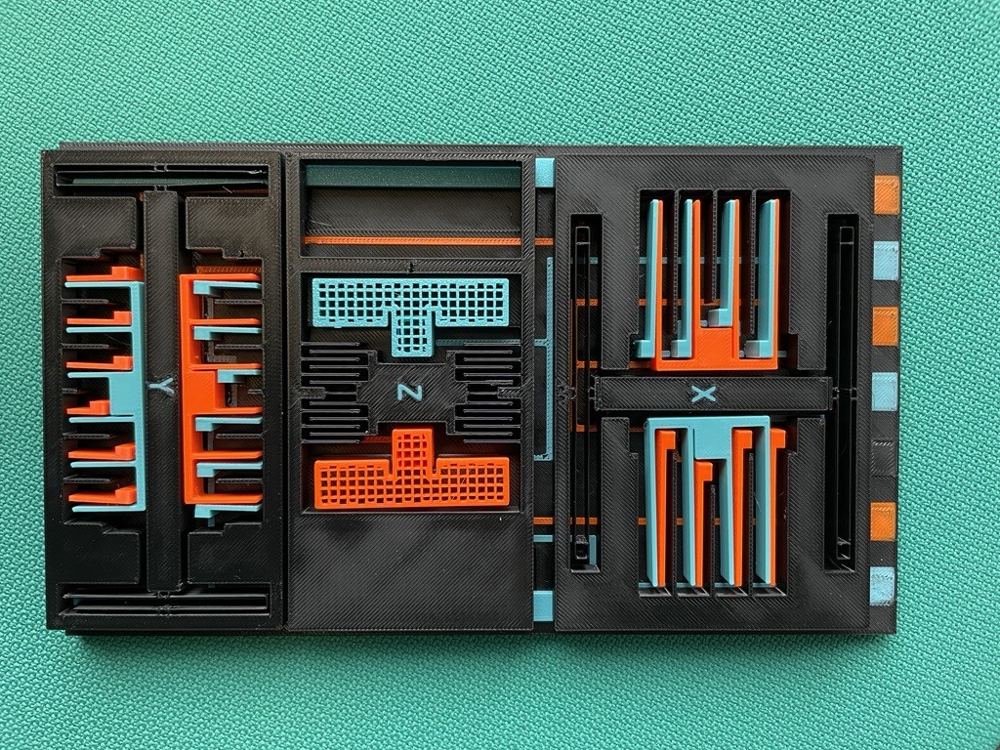
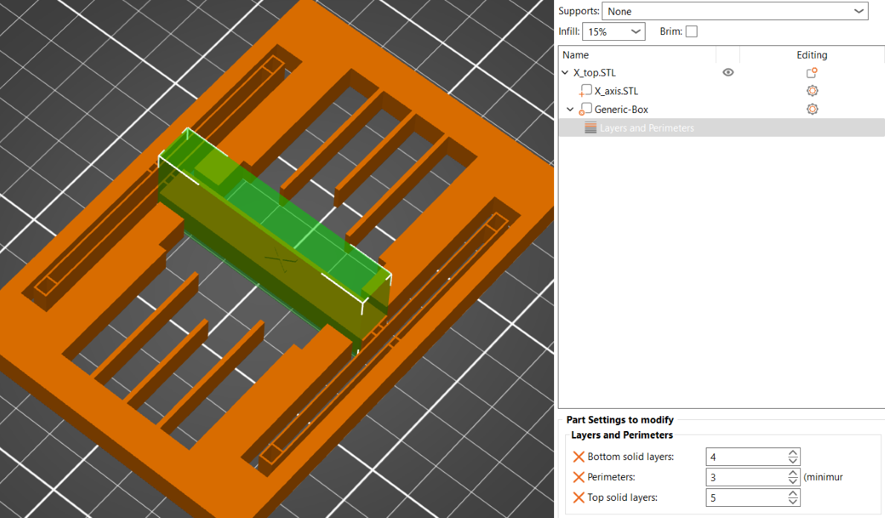
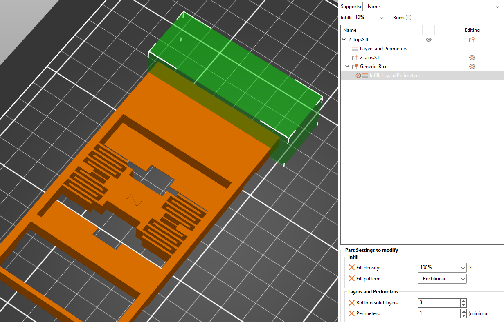
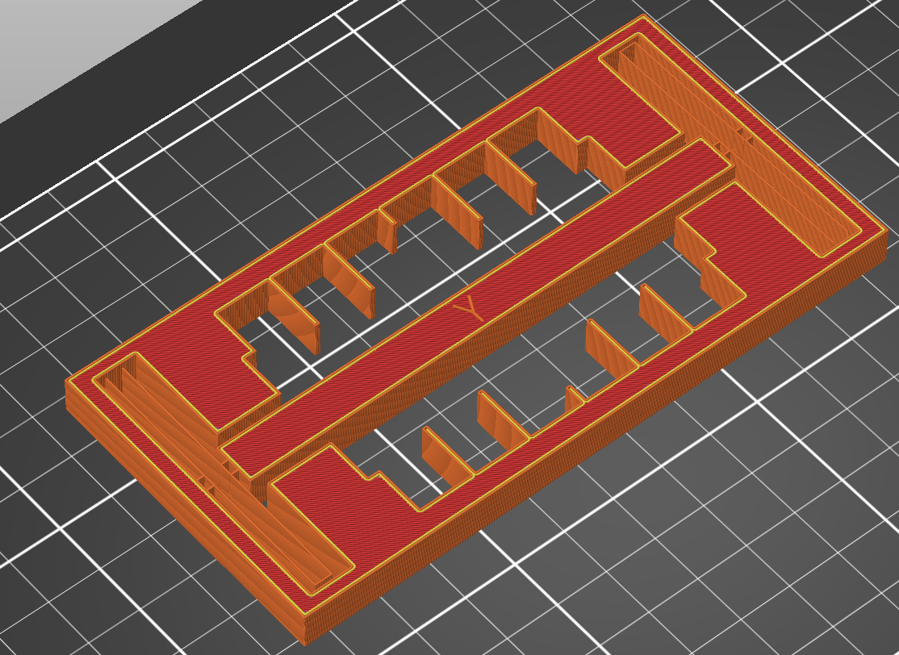
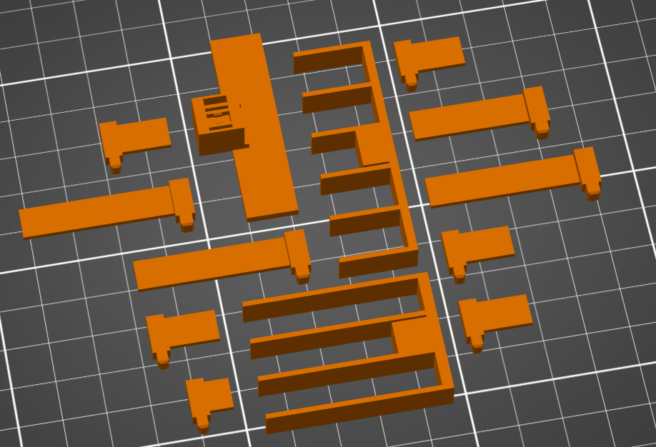

# 3-Axis Accelerometer Model
- Description
- Requirements for Replication
- Part List and Printing Settings
  - General Printing Settings
  - Part: Base (Base)
  - Part: X-Axis MEMS Element (X\_axis)
    - Printing Settings
  - Part: Z-Axis MEMS Element (Z\_axis)
    - Printing Settings
  - Part: Y-Axis MEMS Element (Y\_axis)
    - Printing Settings
  - Parts: Electrodes
    - Printing Settings
  - Part List
    - Color 1
    - Color 2
- Further Material

	
# Description

This is a scaled-up generic MEMS 3-axis accelerometer 3D model for educational purposes. The size of this model is about 250 times larger than that of a MEMS accelerometer.

# Requirements for Replication
- 3 colors of PETG filament
- 3D printer with a 0.4mm nozzle and a print bed with at least 220mm width
- Clean print bed with good adhesion is necessary to prevent parts from coming off the print bed while printing
- For the proof masses to move as intended, the print settings below must be followed closely to get the right weight and stiffness

# Part List and Printing Settings

These instructions are based on PrusaSlicer, but other slicers should work as well. Note that settings may differ between slicers. Some parts may be challenging to print, so replication could require extra effort. A STEP file is included for easy model adjustments to fit different printing setups. In order to print the part correctly, pay attention to the orientation of the parts. Most of the parts have to be rotated before slicing. Use the screenshots below as reference.  

## General Printing Settings
- Layer height: 0.2mm

## Part: Base (Base)

To print the traces in color, follow these steps:

1. Navigate to the "Printer Settings" tab and set the extruder count to 3, even if your printer does not have three extruders. (If this option is not visible, switch to "Expert Mode")
2. Drag the files Base, *Base_circuit_color1*, and *Base_circuit_color2* onto the build plate simultaneously.
3. When prompted, click "Yes" to align the parts.
4. Once imported, assign the desired colors to each part.
5. If your printer does not support automatic filament changes, you can manually change the filament by adding the  `M600` G-code command in the "Tool Change G-code" input field. The print should only require four filament changes.

Since this is a large part, adding a brim is recommended to minimize warping. To enhance the robustness of the top MEMS elements, add the Modifier_mesh file as a modifier and adjust it to increase the top layer count. The image below shows how the model should look before slicing.

After slicing, a wipe tower might appear when setting the extruder count to 3, which is not necessary if you are using a printer without automatic filament changing. You can remove it under the "Wipe tower" section of the print settings.

## Part: X-Axis MEMS Element (X_axis)

### Printing Settings:
- Perimeter Generator: Arachne
- 1 Perimeter
- 3 Top Layers
- 1 Bottom Layer
- 15% Lightning Infill

To increase strength around the attachments, add a box as a modifier by right clicking the part and set the perimeters to 3 and the bottom layers to 3. Make sure that the box does not encompass the meeting point between the springs and the middle rectangle.

## Part: Z-Axis MEMS Element (Z_axis)

### Printing Settings:
- Perimeter Generator: Classic
- 1 Perimeters 
- 5 Top Layers
- 3 Bottom Layers
- 10% Cubic Infill
- Extrusion Width: 0.45mm

Once again, a modifier is needed for the proper weight distribution. Add a box modifier to overlap the last 6mm of the model and set it 100% infill. 

## Part: Y-Axis MEMS Element (Y_axis)

### Printing Settings:
- Perimeter Generator: Arachne
- 2 Perimeters 
- 5 Top Layers
- 4 Bottom Layers
- 10% Cubic Infill

This MEMS element model does not require any modifiers; just ensure that the part's orientation matches the picture below.

## Parts: Electrodes

### Printing Settings
- 2 Perimeters
- 5 Top Layers
- 3 Bottom Layers
- 10% infill

For more realistic Z-electrodes you can apply the following settings for printing the files *Z_axis_electrode_color1* & *Z_axis_electrode_color2*: 

- Fill angle: 0
- 0 Top Layers
- 0 Bottom Layers
- 35% Grid Infill

## Part List
The part *Storage_lock* is meant to avoid the MEMS structures from creeping during storage. The bump on it is supposed to go into the cavity below the Z-Axis. 

### Color 1
* 1x *X_axis_electrode_short*
* 3x *X_axis_electrode_long*
* 1x *X_axis_electrodes*
* 1x *Y_axis_electrode_short*
* 5x *Y_axis_electrode_long*
* 1x *Y_axis_electrodes*
* 1x *Z_axis_electrode_color1*

 

### Color 2
* 1x *X_axis_electrode_short*
* 3x *X_axis_electrode_long*
* 1x *X_axis_electrodes*
* 1x *Y_axis_electrode_short*
* 5x *Y_axis_electrode_long*
* 1x *Y_axis_electrodes*
* 1x *Z_axis_electrode_color2*

# Further Material
[Evolution of Bosch Inertial Measurement Units for Consumer Electronics [YouTube]](https://youtu.be/YX_pCtbetUU?si=Y48k9YNXbdLkJ2fi)

[Bosch MEMS sensors: Working principle of an accelerometer [YouTube]](https://youtu.be/RLQGZl0lpjQ?si=H11uKwXcvrlZT_3T)